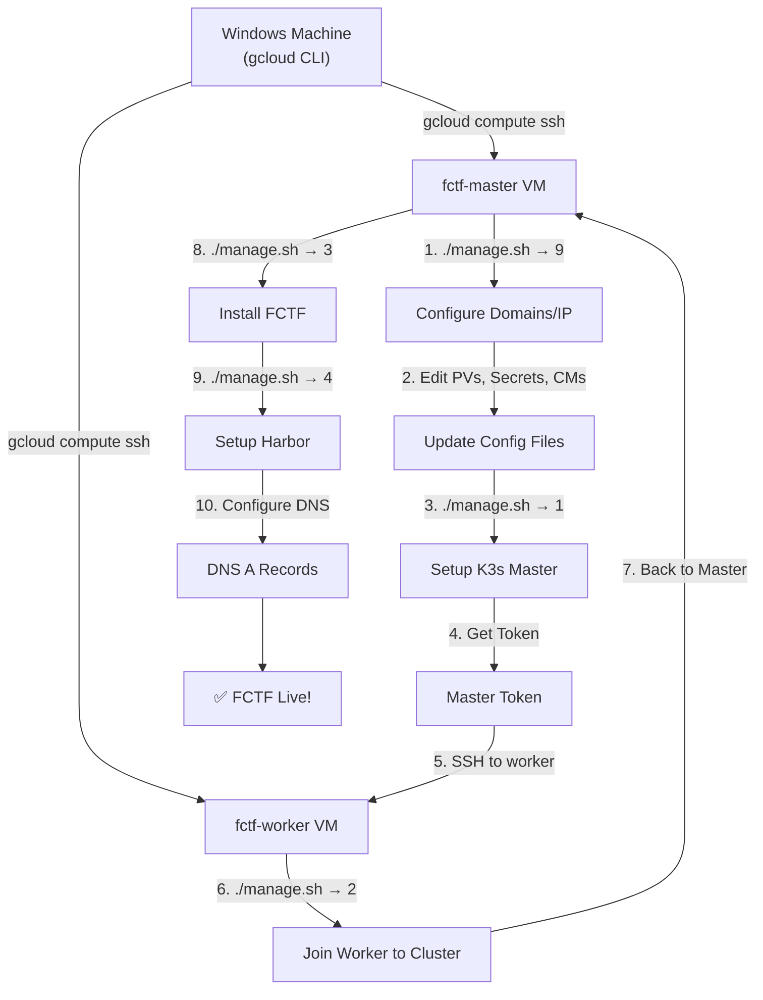

# Guide: Deploying the FCTF Platform on Google Cloud Platform (GCP)

## Table of Contents

1. [Architecture Overview](#1-architecture-overview)
2. [Prerequisites](#2-prerequisites)
3. [Phase 1: Create a GCP Project & Basic Configuration](#3-phase-1)
4. [Phase 2: Create VPC Network & Firewall Rules](#4-phase-2)
5. [Phase 3: Create VM Instances](#5-phase-3)
6. [Phase 4: Install the K3s Cluster](#6-phase-4)
7. [Phase 5: Deploy the FCTF Platform](#7-phase-5)
8. [Phase 6: Configure Domain & SSL](#8-phase-6)
9. [Phase 7: Verify & Troubleshoot](#9-phase-7)
10. [Estimated Cost & Optimization](#10-cost)
11. [Cleanup / Deleting Resources](#11-cleanup)

---

## 1. Architecture Overview

```
┌─────────────────────────────────────────────────────────────────┐
│                    Google Cloud Platform                         │
│                                                                 │
│  ┌──────────────────────────────────────────────────────┐       │
│  │              VPC Network: fctf-vpc                    │       │
│  │              Subnet: 10.148.0.0/24                    │       │
│  │                                                       │       │
│  │  ┌─────────────────────┐  ┌─────────────────────┐    │       │
│  │  │   VM1: fctf-master  │  │   VM2: fctf-worker  │    │       │
│  │  │   8 vCPU, 16GB RAM  │  │   8 vCPU, 32GB RAM  │    │       │
│  │  │   200GB SSD         │  │   200GB SSD         │    │       │
│  │  │                     │  │                     │    │       │
│  │  │  • K3s Server       │  │  • K3s Agent        │    │       │
│  │  │  • NFS Server       │  │  • App Workloads    │    │       │
│  │  │  • Calico CNI       │  │  • Challenge Pods   │    │       │
│  │  │  • Ingress Nginx    │  │  • gVisor Sandbox   │    │       │
│  │  │  • Harbor Registry  │  │                     │    │       │
│  │  └─────────────────────┘  └─────────────────────┘    │       │
│  │           │                        │                  │       │
│  │           └────── Private Link ────┘                 │       │
│  │                  10.148.0.x                           │       │
│  └──────────────────────────────────────────────────────┘       │
│                         │                                       │
│              ┌──────────┴──────────┐                            │
│              │   External IP       │                            │
│              │   (Static)          │                            │
│              └──────────┬──────────┘                            │
│                         │                                       │
└─────────────────────────┼───────────────────────────────────────┘
                          │
                    ┌─────┴─────┐
                    │  Internet  │
                    │  Users     │
                    └───────────┘
```

### Resource Requirements

| VM | vCPU | RAM | Disk | Role |
|---|---|---|---|---|
| **fctf-master** | 8 | 16 GB | 200 GB SSD | K3s Server, NFS Server, Harbor |
| **fctf-worker** | 8 | 32 GB | 200 GB SSD | K3s Agent, runs workloads |

> [!NOTE]
> If you want to save cost for test/demo purposes, you can scale down to:
> - Master: 4 vCPU / 8 GB RAM / 100 GB SSD
> - Worker: 4 vCPU / 16 GB RAM / 100 GB SSD
>
> However, this limits the number of challenges you can deploy concurrently.

---

## 2. Prerequisites

### On your Windows machine

- [ ] **Google Cloud Account** — Sign up at [console.cloud.google.com](https://console.cloud.google.com)
- [ ] **Billing Account** — Requires a credit card (the GCP free trial gives $300 credit / 90 days)
- [ ] **Google Cloud CLI (`gcloud`)** — Install from [cloud.google.com/sdk](https://cloud.google.com/sdk/docs/install)

### Installing the gcloud CLI on Windows

```powershell
# Download and run the Google Cloud SDK installer from:
# https://cloud.google.com/sdk/docs/install#windows

# After installation, open a new PowerShell window and log in:
gcloud init

# Then:
# 1. Log in (opens a browser to sign in with Google)
# 2. Select or create a new project
# 3. Choose a default region (asia-southeast1 is closest to Vietnam)
```

---

## 3. Phase 1: Create a GCP Project & Basic Configuration

### 3.1 Create the Project

```powershell
# Create a new project (the project name must be unique across all of GCP)
gcloud projects create fctf-platform --name="FCTF Platform"

# Set the project as the default
gcloud config set project fctf-platform

# Link a billing account
# (Or go to Console > Billing > Link project)
gcloud billing accounts list
gcloud billing projects link fctf-platform --billing-account=YOUR_BILLING_ACCOUNT_ID
```

### 3.2 Enable the required APIs

```powershell
gcloud services enable compute.googleapis.com
gcloud services enable dns.googleapis.com
```

### 3.3 Set the default region/zone

```powershell
# Pick the region closest to Vietnam (Singapore)
gcloud config set compute/region asia-southeast1
gcloud config set compute/zone asia-southeast1-b
```

> [!TIP]
> **Which region should you choose?**
> | Region | Location | Latency from VN |
> |---|---|---|
> | `asia-southeast1` | Singapore | ~30ms ⭐ |
> | `asia-east1` | Taiwan | ~50ms |
> | `asia-northeast1` | Tokyo | ~80ms |
> | `us-central1` | Iowa, US | ~200ms |

---

## 4. Phase 2: Create VPC Network & Firewall Rules

### 4.1 Create the VPC Network

```powershell
# Create a custom VPC
gcloud compute networks create fctf-vpc `
  --subnet-mode=custom `
  --bgp-routing-mode=regional

# Create the subnet
gcloud compute networks subnets create fctf-subnet `
  --network=fctf-vpc `
  --region=asia-southeast1 `
  --range=10.148.0.0/24
```

### 4.2 Create Firewall Rules

```powershell
# 1) SSH access (from your own IP, or 0.0.0.0/0 for testing)
gcloud compute firewall-rules create fctf-allow-ssh `
  --network=fctf-vpc `
  --allow=tcp:22 `
  --source-ranges=0.0.0.0/0 `
  --target-tags=fctf-node `
  --description="Allow SSH"

# 2) HTTP/HTTPS (for web access from the internet)
gcloud compute firewall-rules create fctf-allow-http-https `
  --network=fctf-vpc `
  --allow=tcp:80,tcp:443 `
  --source-ranges=0.0.0.0/0 `
  --target-tags=fctf-master `
  --description="Allow HTTP and HTTPS"

# 3) K3s API server (so the worker can join the cluster)
gcloud compute firewall-rules create fctf-allow-k3s-api `
  --network=fctf-vpc `
  --allow=tcp:6443 `
  --source-ranges=10.148.0.0/24 `
  --target-tags=fctf-master `
  --description="Allow K3s API from internal subnet"

# 4) Internal traffic between nodes (Calico VXLAN, NFS, etc.)
gcloud compute firewall-rules create fctf-allow-internal `
  --network=fctf-vpc `
  --allow=tcp:0-65535,udp:0-65535,icmp `
  --source-ranges=10.148.0.0/24 `
  --target-tags=fctf-node `
  --description="Allow all internal traffic between nodes"

# 5) NodePort services (if you need direct access via NodePort)
gcloud compute firewall-rules create fctf-allow-nodeports `
  --network=fctf-vpc `
  --allow=tcp:30000-32767 `
  --source-ranges=0.0.0.0/0 `
  --target-tags=fctf-master `
  --description="Allow NodePort range"
```

> [!WARNING]
> **On Security:**
> - The SSH rule with `0.0.0.0/0` should only be used for testing. In production, restrict it to your specific IP.
> - To find your current IP: visit [whatismyip.com](https://whatismyip.com), then replace `0.0.0.0/0` with `YOUR_IP/32`.

### 4.3 Reserve a Static IP (for the Master)

```powershell
# Create a Static External IP for the master node
gcloud compute addresses create fctf-master-ip `
  --region=asia-southeast1

# View the created IP
gcloud compute addresses describe fctf-master-ip --region=asia-southeast1 --format="get(address)"
```

> Write this IP down — you will use it for the TLS SAN and DNS records.

---

## 5. Phase 3: Create VM Instances

### 5.1 Create the Master Node

```powershell
gcloud compute instances create fctf-master `
  --zone=asia-southeast1-b `
  --machine-type=e2-standard-8 `
  --boot-disk-size=200GB `
  --boot-disk-type=pd-ssd `
  --image-family=ubuntu-2204-lts `
  --image-project=ubuntu-os-cloud `
  --network=fctf-vpc `
  --subnet=fctf-subnet `
  --address=fctf-master-ip `
  --tags=fctf-node,fctf-master `
  --metadata=startup-script='#!/bin/bash
    apt update && apt install -y git'
```

### 5.2 Create the Worker Node

```powershell
gcloud compute instances create fctf-worker `
  --zone=asia-southeast1-b `
  --machine-type=e2-highmem-8 `
  --boot-disk-size=200GB `
  --boot-disk-type=pd-ssd `
  --image-family=ubuntu-2204-lts `
  --image-project=ubuntu-os-cloud `
  --network=fctf-vpc `
  --subnet=fctf-subnet `
  --tags=fctf-node,fctf-worker `
  --metadata=startup-script='#!/bin/bash
    apt update && apt install -y git nfs-common'
```

### 5.3 Verify the VMs

```powershell
# List the VMs
gcloud compute instances list

# The output will look like:
# NAME          ZONE                  MACHINE_TYPE   INTERNAL_IP   EXTERNAL_IP     STATUS
# fctf-master   asia-southeast1-b     e2-standard-8  10.148.0.2    34.xxx.xxx.xxx  RUNNING
# fctf-worker   asia-southeast1-b     e2-highmem-8   10.148.0.3    35.xxx.xxx.xxx  RUNNING
```

> [!IMPORTANT]
> **Write these IPs down:**
> | VM | Internal IP | External IP |
> |---|---|---|
> | fctf-master | `10.148.0.x` | `34.xxx.xxx.xxx` (static) |
> | fctf-worker | `10.148.0.x` | `35.xxx.xxx.xxx` |
>
> You will need them in the following steps.

### 5.4 Choosing the Right Machine Type

| Machine Type | vCPU | RAM | Price ~USD/month | Notes |
|---|---|---|---|---|
| `e2-standard-8` | 8 | 32 GB | ~$195 | Recommended for the master |
| `e2-highmem-8` | 8 | 64 GB | ~$260 | If the worker needs lots of RAM |
| `e2-standard-4` | 4 | 16 GB | ~$97 | Budget option for the master |
| `e2-highmem-4` | 4 | 32 GB | ~$130 | Budget option for the worker |
| `n2d-standard-8` | 8 | 32 GB | ~$205 | AMD, better performance |

> [!TIP]
> **Saving cost:**
> - Use **Spot VMs** (add `--provisioning-model=SPOT`) → ~60-90% cheaper, but the VM can be reclaimed at any time.
> - Use **Committed Use Discounts** for long-running deployments (1 year → ~37% off, 3 years → ~55% off).
> - Use `e2-medium` (2 vCPU, 4 GB) for quick testing, then scale up later.

---

## 6. Phase 4: Install the K3s Cluster

### 6.1 SSH into the Master Node

```powershell
# From your Windows machine, SSH into the master
gcloud compute ssh fctf-master --zone=asia-southeast1-b
```

> On the first SSH, gcloud automatically generates an SSH key pair. Press Enter when prompted for a passphrase.

### 6.2 On the Master: Clone the repo & Configure

```bash
# Clone the FCTF repository
git clone <repo-url> FCTF
cd FCTF
chmod +x manage.sh

# ===== Step 1: Configure domains/IP =====
./manage.sh
# Choose: 9) Configure service domains/IP
```

When prompted, enter the following values:

| Token | Value | Explanation |
|---|---|---|
| `MASTER_NODE_PRIVATE_IP` | `10.148.0.x` | Master's internal IP (get it from `hostname -I`) |
| `RABBITMQ_DOMAIN` | `rabbitmq.fctf.yourdomain.com` | Or use `rabbitmq.local` if you don't have a domain yet |
| `GRAFANA_DOMAIN` | `grafana.fctf.yourdomain.com` | |
| `CONTESTANT_DOMAIN` | `contest.fctf.yourdomain.com` | Main domain for contestants |
| `ADMIN_DOMAIN` | `admin.fctf.yourdomain.com` | Admin panel domain |
| `ARGO_DOMAIN` | `argo.fctf.yourdomain.com` | |
| `CONTESTANT_API_DOMAIN` | `api.fctf.yourdomain.com` | API endpoint |
| `REGISTRY_DOMAIN` | `registry.fctf.yourdomain.com` | Harbor registry |
| `RANCHER_DOMAIN` | `rancher.fctf.yourdomain.com` | |
| `GATEWAY_DOMAIN` | `gateway.fctf.yourdomain.com` | Challenge gateway |

> [!TIP]
> **If you don't have your own domain yet**, you can use [nip.io](https://nip.io) (free wildcard DNS):
> - `CONTESTANT_DOMAIN` → `contest.34.xxx.xxx.xxx.nip.io`
> - `ADMIN_DOMAIN` → `admin.34.xxx.xxx.xxx.nip.io`
> - ...replace `34.xxx.xxx.xxx` with the master's actual External IP.
>
> Alternatively, use `.local` names and add them to your local machine's hosts file.

### 6.3 On the Master: Update the configuration before installing

> [!CAUTION]
> **REQUIRED before running the master setup.** If you skip this, services will not be able to reach each other.

```bash
# --- 1. Update the NFS server IP in the PV files ---
MASTER_INTERNAL_IP=$(hostname -I | awk '{print $1}')

# Update all PV files
sed -i "s|server:.*|server: ${MASTER_INTERNAL_IP}|g" \
  FCTF-k3s-manifest/prod/storage/pv/admin-mvc-pv.yaml \
  FCTF-k3s-manifest/prod/storage/pv/contestant-be-pv.yaml \
  FCTF-k3s-manifest/prod/storage/pv/up-challenge-workflow-pv.yaml \
  FCTF-k3s-manifest/prod/storage/pv/start-challenge-workflow-pv.yaml

# --- 2. Update the Secrets (REPLACE ALL DEFAULT PASSWORDS) ---
# Open and edit each secret file
nano FCTF-k3s-manifest/prod/env/secret/mariadb-auth-secret.yaml
nano FCTF-k3s-manifest/prod/env/secret/redis-auth-secret.yaml
# ... (edit every file in the secret/ directory)

# --- 3. Review the ConfigMaps (URLs, API endpoints) ---
nano FCTF-k3s-manifest/prod/env/configmap/contestant-be-cm.yaml
nano FCTF-k3s-manifest/prod/env/configmap/challenge-gateway-cm.yaml
# ... (review every file in the configmap/ directory)
```

### 6.4 On the Master: Set up the K3s Server

```bash
# ===== Step 2: Set up the K3s Master =====
./manage.sh
# Choose: 1) Setup master

# When prompted:
#   Master TLS SAN: enter the master's EXTERNAL IP (e.g. 34.124.131.240)
#   NFS allowed subnet: enter 10.148.0.0/24 (the private subnet range)
```

The script automatically:
1. ✅ Updates system packages
2. ✅ Configures kernel modules (br_netfilter, overlay)
3. ✅ Disables swap
4. ✅ Sets up the NFS server at `/srv/nfs/share`
5. ✅ Installs the K3s server
6. ✅ Installs gVisor (runsc) for sandboxing
7. ✅ Installs Calico CNI (VXLAN mode)
8. ✅ Applies the RuntimeClass for gVisor
9. ✅ Taints the master node

```bash
# Verify the K3s server is running
kubectl get nodes
# NAME               STATUS   ROLES                  AGE   VERSION
# server-1-master    Ready    control-plane,master   1m    v1.xx.x+k3s1

# Get the master token (needed for the worker to join)
./manage.sh
# Choose: 7) Get master token
# Copy the token from the output
```

### 6.5 SSH into the Worker Node & Join the Cluster

```powershell
# Open a NEW terminal on Windows and SSH into the worker
gcloud compute ssh fctf-worker --zone=asia-southeast1-b
```

```bash
# On the worker node
git clone <repo-url> FCTF
cd FCTF
chmod +x manage.sh

# ===== Set up the Worker =====
./manage.sh
# Choose: 2) Setup worker

# When prompted:
#   Master URL: https://10.148.0.x:6443   (the master's INTERNAL IP)
#   Master token: <paste the token from the previous step>
```

### 6.6 Verify the Cluster (back on the Master)

```bash
# SSH back into the master
kubectl get nodes -o wide
# NAME               STATUS   ROLES                  AGE   VERSION   INTERNAL-IP
# server-1-master    Ready    control-plane,master   5m    v1.xx     10.148.0.2
# worker-1           Ready    <none>                 1m    v1.xx     10.148.0.3
```

---

## 7. Phase 5: Deploy the FCTF Platform

### 7.1 Install FCTF (on the Master)

```bash
# ===== Step 3: Install FCTF =====
./manage.sh
# Choose: 3) Install FCTF
```

The `apply-fctf.sh` script automatically performs:

| Step | Description | Estimated time |
|---|---|---|
| 1 | Create namespaces (app, db, argo, storage) | ~5s |
| 2 | Apply Secrets & ConfigMaps | ~5s |
| 3 | Apply PVs & PVCs | ~5s |
| 4 | Install Helm (if not already present) | ~30s |
| 5 | Deploy Helm charts (MariaDB, Redis, RabbitMQ, Argo, Nginx, Monitoring) | ~5-10 min |
| 6 | Deploy the 7 app services | ~2 min |
| 7 | Apply NetworkPolicies | ~5s |
| 8 | Apply Ingress rules | ~5s |
| 9 | Apply CronJobs & Argo templates | ~5s |
| 10 | Bootstrap RabbitMQ users | ~1-2 min |
| 11 | Initialize the MariaDB schema & grants | ~1 min |
| 12 | Rotate service passwords | ~2 min |

### 7.2 Monitor Progress

```bash
# Watch pods being created
watch kubectl get pods -A

# Wait until ALL pods are in Running/Completed state
# The first run can take 10-20 minutes (pulling images)
```

Expected state:

```
NAMESPACE   NAME                                    READY   STATUS
app         admin-mvc-xxx                           1/1     Running
app         contestant-be-xxx                       1/1     Running
app         contestant-portal-xxx                   1/1     Running
app         deployment-center-xxx                   1/1     Running
app         deployment-consumer-xxx                 1/1     Running
app         deployment-listener-xxx                 1/1     Running
app         challenge-gateway-xxx                   1/1     Running
db          mariadb-0                               1/1     Running
db          redis-master-0                          1/1     Running
db          rabbitmq-0                              1/1     Running
argo        argo-workflows-server-xxx               1/1     Running
...
```

### 7.3 Set up Harbor (Optional but Recommended)

```bash
# ===== Step 4: Set up Harbor =====
./manage.sh
# Choose: 4) Setup harbor
```

> [!NOTE]
> Harbor is used to store the Docker images for challenges. If you don't install Harbor, you can use DockerHub or GCR (Google Container Registry) instead.

### 7.4 Set up CI/CD (Optional)

```bash
./manage.sh
# Choose: 5) Setup CI/CD
```

---

## 8. Phase 6: Configure Domain & SSL

### Option A: Use Your Own Domain (Recommended for Production)

#### 8.1 Buy or use an existing domain

You need to point DNS records at the master node's External IP.

#### 8.2 Configure DNS Records

Go to your DNS provider (Cloudflare, Google Domains, Namecheap, etc.) and create these **A Records**:

| Type | Name | Value | TTL |
|---|---|---|---|
| A | `contest.fctf` | `34.xxx.xxx.xxx` (Master External IP) | 300 |
| A | `admin.fctf` | `34.xxx.xxx.xxx` | 300 |
| A | `api.fctf` | `34.xxx.xxx.xxx` | 300 |
| A | `gateway.fctf` | `34.xxx.xxx.xxx` | 300 |
| A | `argo.fctf` | `34.xxx.xxx.xxx` | 300 |
| A | `grafana.fctf` | `34.xxx.xxx.xxx` | 300 |
| A | `rabbitmq.fctf` | `34.xxx.xxx.xxx` | 300 |
| A | `registry.fctf` | `34.xxx.xxx.xxx` | 300 |
| A | `rancher.fctf` | `34.xxx.xxx.xxx` | 300 |

> Replace `fctf` with your actual domain, e.g. `contest.fctf.example.com`

#### 8.3 SSL Certificates (automatic via cert-manager)

The project is already configured with **cert-manager** + **Let's Encrypt**. Once DNS points correctly, certificates are issued automatically.

```bash
# Verify certificates
kubectl get certificates -A
kubectl get certificaterequests -A

# Check the status
kubectl describe certificate -n app <certificate-name>
```

### Option B: Use nip.io (Fast, for Test/Demo)

No domain purchase required. Uses a free wildcard DNS service.

```bash
# Example: Master External IP = 34.124.131.240
# These domains resolve automatically:
# contest.34.124.131.240.nip.io  → 34.124.131.240
# admin.34.124.131.240.nip.io    → 34.124.131.240
```

> [!WARNING]
> nip.io **does NOT support SSL/HTTPS** via Let's Encrypt (domain ownership cannot be verified).
> Use HTTP only, for testing.

### Option C: Use Google Cloud DNS (Managed DNS)

```powershell
# Create a DNS zone on GCP
gcloud dns managed-zones create fctf-zone `
  --dns-name="fctf.yourdomain.com." `
  --description="FCTF Platform DNS"

# Add A records
gcloud dns record-sets create contest.fctf.yourdomain.com. `
  --zone=fctf-zone `
  --type=A `
  --ttl=300 `
  --rrdatas=34.xxx.xxx.xxx

# Repeat for the other subdomains...

# Get the nameservers → update them at your domain registrar
gcloud dns managed-zones describe fctf-zone --format="get(nameServers)"
```

---

## 9. Phase 7: Verify & Troubleshoot

### 9.1 Check the entire system

```bash
# 1. Nodes
kubectl get nodes -o wide

# 2. All Pods
kubectl get pods -A

# 3. Services
kubectl get svc -A

# 4. Ingress
kubectl get ingress -A

# 5. PV/PVC
kubectl get pv,pvc -A

# 6. Events (view recent errors)
kubectl get events -A --sort-by='.lastTimestamp' | tail -20
```

### 9.2 Access a Service (if you don't have a domain yet)

```bash
# Port-forward from the master
kubectl port-forward -n app svc/contestant-portal 8080:80 --address=0.0.0.0 &
kubectl port-forward -n app svc/contestant-be 5000:80 --address=0.0.0.0 &
kubectl port-forward -n app svc/admin-mvc 4000:8000 --address=0.0.0.0 &

# Access from a browser:
# http://MASTER_EXTERNAL_IP:8080  → Contestant Portal
# http://MASTER_EXTERNAL_IP:5000  → API
# http://MASTER_EXTERNAL_IP:4000  → Admin Panel
```

> Remember to add a firewall rule for ports 8080, 5000, and 4000 when port-forwarding:
> ```powershell
> gcloud compute firewall-rules create fctf-allow-portforward `
>   --network=fctf-vpc `
>   --allow=tcp:4000,tcp:5000,tcp:8080 `
>   --source-ranges=0.0.0.0/0 `
>   --target-tags=fctf-master
> ```

### 9.3 Common Troubleshooting

#### Pod stuck in `Pending`

```bash
# See the reason
kubectl describe pod <pod-name> -n <namespace>

# Common causes:
# 1. Insufficient resources → scale up the machine type
# 2. No nodes available → check taints/tolerations
# 3. PVC pending → check the NFS server
```

#### Pod in `CrashLoopBackOff`

```bash
# View the logs
kubectl logs <pod-name> -n <namespace> --previous

# Common causes:
# 1. Wrong connection string → check ConfigMaps/Secrets
# 2. DB not ready yet → wait for the MariaDB pod to start first
# 3. Image pull error → check the image name and registry access
```

#### Services cannot reach each other

```bash
# Test DNS from inside the cluster
kubectl run -it --rm debug --image=busybox -- nslookup mariadb.db.svc.cluster.local

# Check NetworkPolicy
kubectl get networkpolicy -A

# Check Calico
kubectl get pods -n kube-system | grep calico
```

#### NFS mount fails

```bash
# On the master, check the NFS server
sudo exportfs -v
sudo systemctl status nfs-kernel-server

# On the worker, test the mount
sudo mount -t nfs MASTER_INTERNAL_IP:/srv/nfs/share /mnt
ls /mnt
sudo umount /mnt
```

---

## 10. Estimated Cost & Optimization

### Monthly cost (estimated, region asia-southeast1)

| Resource | Spec | Cost/month (USD) |
|---|---|---|
| VM Master | e2-standard-8 (8 vCPU, 32GB) | ~$195 |
| VM Worker | e2-highmem-8 (8 vCPU, 64GB) | ~$260 |
| Disk Master | 200GB SSD | ~$34 |
| Disk Worker | 200GB SSD | ~$34 |
| Static IP | 1 IP | ~$7 |
| Network Egress | ~50GB/month | ~$6 |
| **Total** | | **~$536/month** |

### How to save

| Method | Savings | Notes |
|---|---|---|
| Use `e2-standard-4` for both VMs | ~50% | Enough for a small test/demo |
| Use **Spot VMs** | ~60-90% | The VM can be reclaimed |
| **Committed Use** (1 year) | ~37% | Requires a usage commitment |
| Stop VMs when not in use | Varies | `gcloud compute instances stop` |
| Use **Standard Disk** instead of SSD | ~40% of disk cost | Slower I/O |

### Stopping/Starting VMs to save money

```powershell
# Stop when not in use (data is NOT lost)
gcloud compute instances stop fctf-master fctf-worker --zone=asia-southeast1-b

# Start again when needed
gcloud compute instances start fctf-master fctf-worker --zone=asia-southeast1-b

# After starting again, SSH into the master and check:
# K3s restarts automatically, but it may take 2-3 minutes for all pods to become healthy
```

> [!IMPORTANT]
> When a VM is stopped, you are **not charged for the VM** (only for the disk and static IP).
> This is the most effective way to save money if you only use it a few hours a day.

---

## 11. Cleanup / Deleting Resources

When you no longer need it, **DELETE EVERYTHING** to avoid charges:

```powershell
# 1. Delete the VMs
gcloud compute instances delete fctf-master fctf-worker `
  --zone=asia-southeast1-b --quiet

# 2. Delete the Static IP
gcloud compute addresses delete fctf-master-ip `
  --region=asia-southeast1 --quiet

# 3. Delete the Firewall rules
gcloud compute firewall-rules delete `
  fctf-allow-ssh `
  fctf-allow-http-https `
  fctf-allow-k3s-api `
  fctf-allow-internal `
  fctf-allow-nodeports --quiet

# 4. Delete the Subnet & VPC
gcloud compute networks subnets delete fctf-subnet `
  --region=asia-southeast1 --quiet
gcloud compute networks delete fctf-vpc --quiet

# 5. (Optional) Delete the DNS zone
gcloud dns managed-zones delete fctf-zone --quiet

# 6. Verify no resources remain
gcloud compute instances list
gcloud compute addresses list
gcloud compute firewall-rules list --filter="network:fctf-vpc"
```

> [!CAUTION]
> **Deleting a VM also deletes its disk and all data.** If you want to keep the data, create a snapshot first:
> ```powershell
> gcloud compute disks snapshot fctf-master `
>   --zone=asia-southeast1-b `
>   --snapshot-names=fctf-master-backup
> ```

---

## Quick Reference: End-to-End Command Flow



### Quick Checklist

- [ ] Create GCP project + enable APIs
- [ ] Create VPC + Firewall rules
- [ ] Reserve Static IP
- [ ] Create Master VM + Worker VM
- [ ] SSH into Master → Clone repo
- [ ] `./manage.sh → 9` (Configure domains)
- [ ] Edit PV files (NFS server IP)
- [ ] Edit Secrets (passwords)
- [ ] Review ConfigMaps (URLs)
- [ ] `./manage.sh → 1` (Setup master)
- [ ] SSH into Worker → Clone repo
- [ ] `./manage.sh → 2` (Join cluster)
- [ ] Back to Master → `./manage.sh → 3` (Install FCTF)
- [ ] `./manage.sh → 4` (Setup Harbor)
- [ ] Configure DNS records
- [ ] Verify all pods are Running
- [ ] Test web access
